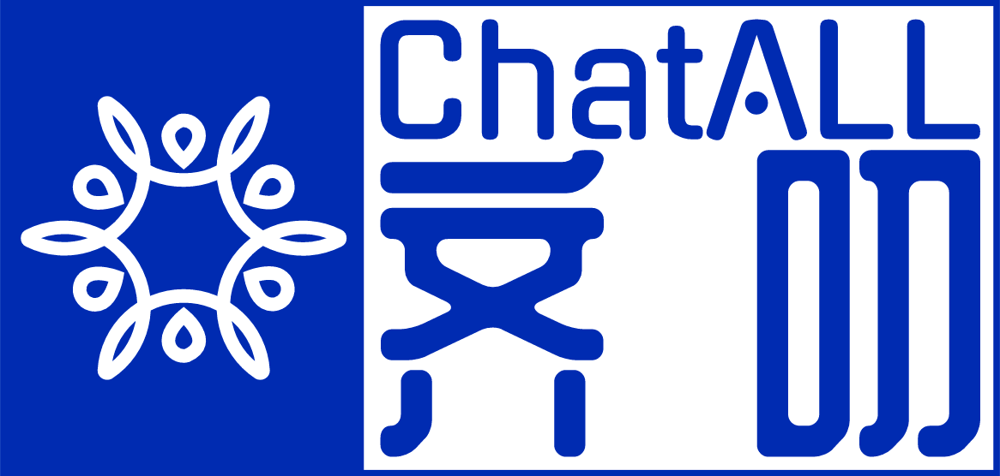

<div align="center">
  </img>
  <p><strong>與所有 AI 機器人同時對話，發掘最佳解答</strong></p>

[Deutsch](README_DE-DE.md) | [English](../README.md) | [Español](README_ES-ES.md) | [Français](README_FR-FR.md) | [Italian](README_IT-IT.md) | [日本語](README_JA-JP.md) | [한국어](README_KO-KR.md) | [Русский](README_RU-RU.md) | [Tiếng Việt](README_VI-VN.md) | [العربية](README_AR-AR.md)| [简体中文](README_ZH-CN.md) | 繁體中文

[](https://codespaces.new/sunner/ChatALL)

</div>

## Screenshots


## Features

大型語言模型（LLMs）為基礎的 AI 機器人非常出色，但它們的行為可能隨機且各有強項。想要獲得最佳體驗，不必逐一嘗試每個模型。ChatALL（中文名稱：齊叨）可以同時將提示發送至多個 AI 機器人，幫助您發現最佳結果。您只需[下載、安裝](https://github.com/sunner/ChatALL/releases)並發問即可。

### 這是你嗎？

ChatALL 的典型使用者：

- 🤠**LLMs 大師**，希望從 LLMs 中找出最好的答案或創作。
- 🤓**LLMs 研究人員**，希望直觀地比較各種 LLMs 在不同領域的優缺點。
- 😎**LLM 應用開發者**，希望快速調試提示並找到表現最佳的基礎模型。

### 支援的機器人

| AI 機器人                                                                          | Web Access  | API         | 備註                                         |
| ---------------------------------------------------------------------------------- | ----------- | ----------- | -------------------------------------------- |
| [360 AI Brain](https://ai.360.cn/)                                                 | Yes         | No API      |                                              |
| [Baidu ERNIE](https://yiyan.baidu.com/)                                            | No          | Yes         |                                              |
| [Character.AI](https://character.ai/)                                              | Yes         | No API      |                                              |
| [ChatGLM2 6B & 130B](https://chatglm.cn/)                                          | Yes         | No API      | 不需登錄                                      |
| [ChatGPT](https://chatgpt.com)                                                     | Yes         | Yes         | 包含網頁瀏覽及 Azure OpenAI 服務              |
| [Claude](https://www.anthropic.com/claude)                                         | Yes         | Yes         |                                              |
| [Code Llama](https://ai.meta.com/blog/code-llama-large-language-model-coding/)     | Yes         | No API      |                                              |
| [Cohere Aya 23](https://cohere.com/blog/aya23)                                     | No          | Yes         |                                              |
| [Cohere Command R Models](https://cohere.com/command)                              | No          | Yes         |                                              |
| [Copilot](https://copilot.microsoft.com/)                                          | Yes         | No API      |                                              |
| [Dedao Learning Assistant](https://ai.dedao.cn/)                                   | Coming soon | No API      |                                              |
| [Falcon 180B](https://huggingface.co/tiiuae/falcon-180B-chat)                      | Yes         | No API      |                                              |
| [Gemini](https://gemini.google.com/)                                               | Yes         | Yes         |                                              |
| [Gemma 2B & 7B](https://blog.google/technology/developers/gemma-open-models/)      | Yes         | No API      |                                              |
| [Gradio](https://gradio.app/)                                                      | Yes         | No API      | 用於 Hugging Face space/自行部署的模型        |
| [Groq Cloud](https://console.groq.com/docs/models)                                 | No          | Yes         |                                              |
| [HuggingChat](https://huggingface.co/chat/)                                        | Yes         | No API      |                                              |
| [iFLYTEK SPARK](http://xinghuo.xfyun.cn/)                                          | Yes         | Coming soon |                                              |
| [Kimi](https://kimi.moonshot.cn/)                                                  | Yes         | No API      |                                              |
| [Llama 2 13B & 70B](https://ai.meta.com/llama/)                                    | Yes         | No API      |                                              |
| [MOSS](https://moss.fastnlp.top/)                                                  | Yes         | No API      |                                              |
| [Perplexity](https://www.perplexity.ai/)                                           | Yes         | No API      |                                              |
| [Phind](https://www.phind.com/)                                                    | Yes         | No API      |                                              |
| [Pi](https://pi.ai)                                                                | Yes         | No API      |                                              |
| [Poe](https://poe.com/)                                                            | Yes         | Coming soon |                                              |
| [SkyWork](https://neice.tiangong.cn/)                                              | Yes         | Coming soon |                                              |
| [Tongyi Qianwen](http://tongyi.aliyun.com/)                                        | Yes         | Coming soon |                                              |
| [Vicuna 13B & 33B](https://lmsys.org/blog/2023-03-30-vicuna/)                      | Yes         | No API      | 不需登錄                                      |
| [WizardLM 70B](https://github.com/nlpxucan/WizardLM)                               | Yes         | No API      |                                              |
| [YouChat](https://you.com/)                                                        | Yes         | No API      |                                              |
| [You](https://you.com/)                                                            | Yes         | No API      |                                              |
| [Zephyr](https://huggingface.co/spaces/HuggingFaceH4/zephyr-chat)                  | Yes         | No API      |                                              |

更多即將上線。請在[這些問題](https://github.com/sunner/ChatALL/labels/more%20LLMs)中為您喜愛的機器人投票。

### 其他功能

- 快速提示模式：在前一個請求完成前發送下一個提示
- 本地保存聊天記錄，保護您的隱私
- 突出顯示您喜歡的回應，刪除不佳的回應
- 隨時啟用/禁用任何機器人
- 切換單欄、雙欄或三欄視圖
- 自動更新到最新版本
- 深色模式（由 @tanchekwei 貢獻）
- 快捷鍵。按 <kbd>Ctrl</kbd> + <kbd>/</kbd> 了解所有快捷鍵（由 @tanchekwei 貢獻）
- 多重聊天（由 @tanchekwei 貢獻）
- 代理設置（由 @msaong 貢獻）
- 提示管理（由 @tanchekwei 貢獻）
- 支援多語言（中文、英文、德文、法文、俄文、越南文、韓文、日文、西班牙文、義大利文）
- 支援 Windows、macOS 和 Linux

計劃功能：

歡迎您為這些功能做出貢獻。

- [ ] 將前端部署到 GitHub Pages

## Privacy

所有聊天記錄、設定及登入資料均保存在您的電腦上。

ChatALL 收集匿名使用數據以幫助改進產品。包括：

- 提示了哪些 AI 機器人以及提示的長度。不包括提示內容。
- 回應的長度以及哪些回應被刪除/突出顯示。不包括回應內容。

## Prerequisites

ChatALL 是一個客戶端，而不是代理。因此，您必須：

1. 擁有機器人的有效帳號和/或 API 令牌。
2. 有可靠的網路連接至機器人。

## Download / Install

下載連結：https://github.com/sunner/ChatALL/releases

### On Windows

直接下載 \*-win.exe 檔案並按照指示安裝。

### On macOS

Apple Silicon Mac (M1, M2 CPU) 請下載 \*-mac-arm64.dmg 檔案。

其他 Mac 請下載 \*-mac-x64.dmg 檔案。

若您使用 [Homebrew](https://brew.sh/)，也可執行以下指令安裝：

```bash
brew install --cask chatall
```

### 在 Linux 上

基於 Debian 的發行版：下載 .deb 文件，雙擊並安裝該軟件。
基於 Arch 的發行版：你可以從 [這裡](https://aur.archlinux.org/packages/chatall-bin) 克隆 AUR 中的 ChatALL。你可以手動安裝或使用 AUR 助手如 yay 或 paru 進行安裝。
其他發行版：下載 .AppImage 文件，使其可執行，並享受點擊即運行的體驗。你也可以使用 [AppimageLauncher](https://github.com/TheAssassin/AppImageLauncher)。

## 疑難排解

如果您在使用 ChatALL 時遇到任何問題，可以嘗試以下方法來解決：

1. **刷新** - 按 <kbd>Ctrl</kbd> + <kbd>R</kbd> 或 <kbd>⌘</kbd> + <kbd>R</kbd>。
2. **重新啟動** - 退出 ChatALL 並再次運行它。
3. **重新登錄** - 點擊右上角的設置按鈕，然後點擊相應的登錄/登出連結重新登錄網站。
4. **創建新聊天** - 點擊 `New Chat` 按鈕並再次發送提示。

如果以上方法都無效，您可以嘗試 **重置 ChatALL**。請注意，這將刪除您所有的設置和消息記錄。

您可以通過刪除以下目錄來重置 ChatALL：

- Windows: `C:\Users\<user>\AppData\Roaming\chatall\`
- Linux: `/home/<user>/.config/chatall/`
- macOS: `/Users/<user>/Library/Application Support/chatall/`

如果問題仍然存在，請 [提交問題](https://github.com/sunner/ChatALL/issues)。

## 對於開發者

### 貢獻一個 Bot

[指南](https://github.com/sunner/ChatALL/wiki/%E5%A6%82%E4%BD%95%E6%B7%BB%E5%8A%A0%E4%B8%80%E4%B8%AA%E6%96%B0%E7%9A%84-AI-%E5%AF%B9%E8%AF%9D%E6%9C%BA%E5%99%A8%E4%BA%BA) 可能對你有幫助。

### 運行

```bash
npm install
npm run electron:serve
```

### 建置

為當前平台建置：

```bash
npm run electron:build
```

建置所有平台：

```bash
npm run electron:build -- -wml --x64 --arm64
```

## 貢獻者

### 貢獻者

<a href="https://github.com/sunner/ChatALL/graphs/contributors">
  
</a>

### 其他

- GPT-4 貢獻了大部分的代碼
- ChatGPT、Copilot 和 Google 提供了許多解決方案（依順序排列）
- 靈感來源於 [ChatHub](https://github.com/chathub-dev/chathub)。致敬！

## 贊助

如果你喜歡這個專案，請考慮：

[](https://ko-fi.com/F1F8KZJGJ)


