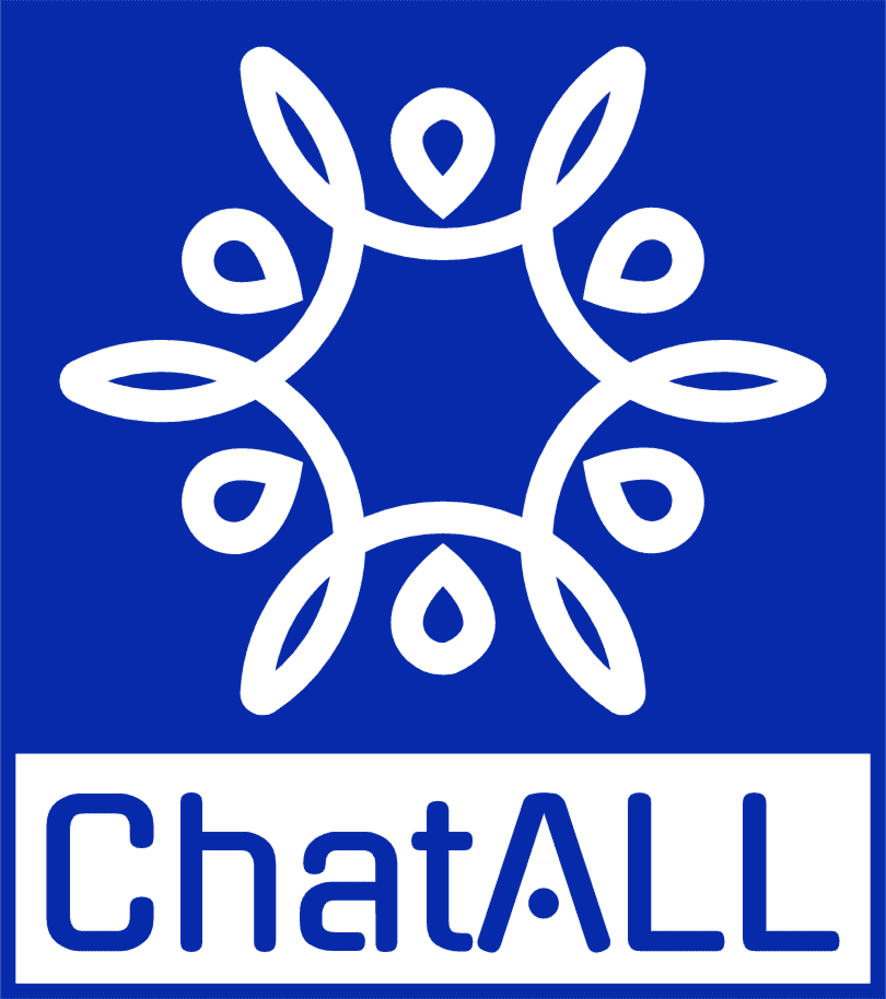

<div align="center">
  </img>
  <p><strong>Discutez avec tous les bots IA simultanément pour sélectionner la meilleure réponse</strong></p>

[Deutsch](README_DE-DE.md) | [English](README.md) | [Español](README_ES-ES.md) | Français | [Italian](README_IT-IT.md) | [日本語](README_JA-JP.md) | [한국어](README_KO-KR.md) | [Русский](README_RU-RU.md) | [Tiếng Việt](README_VI-VN.md) | [简体中文](README_ZH-CN.md)

[](https://codespaces.new/ai-shifu/ChatALL)

</div>

## Captures d'écran


## Fonctionnalités

Les robots d'intelligence artificielle basés sur les grands modèles de langage (Large Language Models ou LLMs) sont incroyables. Cependant, leur comportement peut être aléatoire et différents robots excellent dans différentes tâches. Si vous voulez la meilleure expérience, ne les essayez pas un par un. ChatALL (nom chinois : 齐叨) peut envoyer des invites à plusieurs robots IA simultanément afin de vous permettre de sélectionner la réponse qui vous semblera la plus pertinente. Tout ce que vous avez à faire est de [télécharger, installer](https://github.com/ai-shifu/ChatALL/releases) et poser votre question.

### Est-ce vous ?

Les utilisateurs typiques de ChatALL sont :

- 🤠**Experts en LLMs**, qui veulent trouver les meilleures réponses ou créations des LLMs.
- 🤓**Chercheurs en LLMs**, qui veulent comparer intuitivement les forces et les faiblesses des différents LLMs dans divers domaines.
- 😎**Développeurs d'applications LLM**, qui veulent déboguer rapidement les invites et trouver les modèles de base les plus performants.

### Bots pris en charge

| AI Bots                                                                        | Accès web    | API           | Notes                                              |
| ------------------------------------------------------------------------------ | ------------- | ------------- | -------------------------------------------------- |
| [360 AI Brain](https://ai.360.cn/)                                                | Oui           | Non           |                                                    |
| [Baidu ERNIE](https://yiyan.baidu.com/)                                           | Non           | Oui           |                                                    |
| [Character.AI](https://character.ai/)                                             | Oui           | Non           |                                                    |
| [ChatGLM2 6B &amp; 130B](https://chatglm.cn/)                                     | Oui           | Non           | Pas besoin de compte ou de clé API                |
| [ChatGPT](https://chatgpt.com)                                                    | Oui           | Oui           | Navigation web, inclut services Azure OpenAI       |
| [Claude](https://www.anthropic.com/claude)                                        | Oui           | Oui           |                                                    |
| [Code Llama](https://ai.meta.com/blog/code-llama-large-language-model-coding/)    | Oui           | Non           |                                                    |
| [Cohere Aya 23](https://cohere.com/blog/aya23)                                    | Non           | Oui           |                                                    |
| [Cohere Command R Models](https://cohere.com/command)                             | Non           | Oui           |                                                    |
| [Copilot](https://copilot.microsoft.com/)                                         | Oui           | Non           |                                                    |
| [Dedao Learning Assistant](https://ai.dedao.cn/)                                  | Prochainement | Non           |                                                    |
| [Falcon 180B](https://huggingface.co/tiiuae/falcon-180B-chat)                     | Oui           | Non           |                                                    |
| [Gemini](https://gemini.google.com/)                                              | Oui           | Oui           |                                                    |
| [Gemma 2B &amp; 7B](https://blog.google/technology/developers/gemma-open-models/) | Oui           | Non           |                                                    |
| [Gradio](https://gradio.app/)                                                     | Oui           | Non           | Pour les modèles Hugging Face space/self-deployed |
| [Groq Cloud](https://console.groq.com/docs/models)                                | Non           | Oui           |                                                    |
| [HuggingChat](https://huggingface.co/chat/)                                       | Oui           | Non           |                                                    |
| [iFLYTEK SPARK](http://xinghuo.xfyun.cn/)                                         | Oui           | Prochainement |                                                    |
| [Kimi](https://kimi.moonshot.cn/)                                                 | Oui           | Non           |                                                    |
| [Llama 2 13B &amp; 70B](https://ai.meta.com/llama/)                               | Oui           | Non           |                                                    |
| [MOSS](https://moss.fastnlp.top/)                                                 | Oui           | Non           |                                                    |
| [Perplexity](https://www.perplexity.ai/)                                          | Oui           | Non           |                                                    |
| [Phind](https://www.phind.com/)                                                   | Oui           | Non           |                                                    |
| [Pi](https://pi.ai)                                                               | Oui           | Non           |                                                    |
| [Poe](https://poe.com/)                                                           | Oui           | Prochainement |                                                    |
| [SkyWork](https://neice.tiangong.cn/)                                             | Oui           | Prochainement |                                                    |
| [Tongyi Qianwen](http://tongyi.aliyun.com/)                                       | Oui           | Prochainement |                                                    |
| [Vicuna 13B &amp; 33B](https://lmsys.org/blog/2023-03-30-vicuna/)                 | Oui           | Non           | Pas besoin de compte ou de clé API                |
| [WizardLM 70B](https://github.com/nlpxucan/WizardLM)                              | Oui           | Non           |                                                    |
| [xAI Grok](https://x.ai)                                                          | Non           | Oui           |                                                    |
| [YouChat](https://you.com/)                                                       | Oui           | Non           |                                                    |
| [You](https://you.com/)                                                           | Oui           | Non           |                                                    |
| [Zephyr](https://huggingface.co/spaces/HuggingFaceH4/zephyr-chat)                 | Oui           | Non           |                                                    |

Et plus...

### Note sur la fiabilité des robots IA basés sur le Web

Les robots IA basés sur le Web (marqués "Accès web") sont intrinsèquement moins fiables et rencontrent fréquemment des problèmes de stabilité, car les fournisseurs de services mettent régulièrement à jour leurs interfaces Web et leurs mesures de sécurité. Ces connexions basées sur le Web reposent sur la rétro-ingénierie et sont difficiles à maintenir, se brisant souvent de manière inattendue. Pour une expérience fiable, nous recommandons vivement d'utiliser des robots offrant un accès API lorsque c'est possible.

### Autres fonctionalités

- Mode d'invite rapide : envoyez l'invite suivante sans attendre la fin de la demande précédente.
- Stockage local de l'historique du chat, pour protéger votre vie privée
- Mettez en évidence les réponses que vous aimez, supprimez les mauvaises
- Activer/désactiver les bots à tout moment
- Choix de l'affichage en une, deux ou trois colonnes
- Mise à jour automatique vers la dernière version
- Mode sombre (contribué par @tanchekwei)
- Raccourcis clavier. Appuyez sur `<kbd>`Ctrl`</kbd>` + `<kbd>`/`</kbd>` pour les connaître tous (contribué par @tanchekwei)
- Plusieurs chats (contribué par @tanchekwei)
- Paramètres de proxy (contribué par @msaong)
- Gestion des invites (contribué par @tanchekwei)
- Supporte plusieurs langues (chinois, anglais, allemand, français, russe, vietnamien, coréen, japonais, espagnol, italien)
- Supporte Windows, macOS et Linux

Fonctionnalités prévues :

Vous êtes invités à contribuer à ces fonctionnalités.

- [ ] Déployer le front-end sur GitHub Pages

## Confidentialité

Tout l'historique des discussions, les paramètres et les données de connexion sont enregistrés localement sur votre ordinateur.

ChatALL collecte des données d'utilisation anonymes pour nous aider à améliorer le produit. Cela inclut :

- Quels bots IA sont sollicités et la longueur de l'invite. Le contenu de l'invite n'est pas inclus.
- La longueur de la réponse, et quelles réponses sont supprimées/mises en évidence. Le contenu de la réponse n'est pas inclus.

## Prérequis

ChatALL est un client, pas un proxy. Par conséquent, vous devez :

1. Avoir des comptes et/ou des jetons API fonctionnels pour les bots.
2. Avoir des connexions réseau fiables avec les bots.

## Télécharger / Installer

Télécharger depuis https://github.com/ai-shifu/ChatALL/releases

### Sur Windows

Just download the \*-win.exe file and proceed with the setup.

### Sur macOS

Pour les Macs de type Apple Silicon (M1, M2 CPU), téléchargez le fichier \*-mac-arm64.dmg.

Pour les autres Macs (Intel), téléchargez le fichier \*-mac-x64.dmg.

Si vous utilisez [Homebrew](https://brew.sh/), vous pouvez également l'installer avec :

```bash
brew install --cask chatall
```

### Sur Linux

Distributions basées sur Debian : Téléchargez le fichier .deb, double-cliquez dessus et installez le logiciel.
Distributions basées sur Arch : Vous pouvez cloner ChatALL depuis l'AUR [ici](https://aur.archlinux.org/packages/chatall-bin). Vous pouvez l'installer manuellement ou en utilisant un assistant AUR comme yay ou paru.
Autres distributions : Téléchargez le fichier .AppImage, rendez-le exécutable et profitez de l'expérience "click-to-run". Vous pouvez également utiliser [AppimageLauncher](https://github.com/TheAssassin/AppImageLauncher).

## Dépannage

Si vous rencontrez des problèmes lors de l'utilisation de ChatALL, vous pouvez essayer les méthodes suivantes pour les résoudre :

1. **Rafraîchir** - appuyez sur `<kbd>`Ctrl`</kbd>` + `<kbd>`R`</kbd>` ou `<kbd>`⌘`</kbd>` + `<kbd>`R`</kbd>`.
2. **Redémarrer** - quittez ChatALL et relancez-le.
3. **Reconnectez-vous** - cliquez sur le bouton des paramètres en haut à droite, puis cliquez sur le lien de connexion/déconnexion correspondant pour vous reconnecter au site.
4. **Créer une nouvelle discussion** - cliquez sur le bouton `New Chat` et envoyez l'invite à nouveau.

Si aucune des méthodes ci-dessus ne fonctionne, vous pouvez essayer de **réinitialiser ChatALL**. Notez que cela supprimera tous vos paramètres et l'historique des messages.

Vous pouvez réinitialiser ChatALL en supprimant les répertoires suivants :

- Windows : `C:\Users\<user>\AppData\Roaming\chatall\`
- Linux : `/home/<user>/.config/chatall/`
- macOS : `/Users/<user>/Library/Application Support/chatall/`

Si le problème persiste, veuillez [soumettre un problème](https://github.com/ai-shifu/ChatALL/issues).

## Pour les développeurs

### Contribuer à un bot

[Le guide](https://github.com/ai-shifu/ChatALL/blob/main/doc/developing_bot.md) peut vous aider.

### Lancement

```bash
npm install
npm run electron:serve
```

### Build

Build pour votre plateforme actuelle:

```bash
npm run electron:build
```

Build pour toutes les plateformes:

```bash
npm run electron:build -- -wml --x64 --arm64
```

## Credits

### Contributeurs

<a href="https://github.com/ai-shifu/ChatALL/graphs/contributors">
  
</a>

### Autres

- GPT-4 a contribué à une grande partie du code
- ChatGPT, Copilot et Google fournissent de nombreuses solutions (classées par ordre).
- Inspiré par [ChatHub] (https://github.com/chathub-dev/chathub). Respect !

## Sponsor

Si vous aimez ce projet, veuillez envisager:

[](https://ko-fi.com/F1F8KZJGJ)
